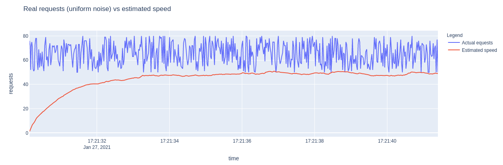

## go-ratelimit

The concept of [rate limiting](https://en.wikipedia.org/wiki/Rate_limiting) is based on the exponential event occurance estimation from [here](https://stackoverflow.com/a/23617678)

### Modeling


### Usage
The usage of standard limiter is quite simple:
```go
rateLimit := 5 // 5 req/sec
r, _ := ratelimit.New(rateLimit, occurance.NoSmoothing)
for i := 1; i < 10; i++ {
    block, speed := r.Allow()
    fmt.Println("requests #", i, "allow:", block, "speed:", speed)
}
```


The package also provides **UserBucket** type to use in HHTP applications:
```go
rand.Seed(time.Now().UTC().UnixNano())

s := ratelimit.NewUserBucket(5, 60, ratelimit.DeafultCleanUP, occurance.NoSmoothing)
s.Start()

userID := "127.0.0.1"

for i := 0; i < 100; i++ {
    time.Sleep(100 * time.Millisecond)
    speed, allow := s.Allow(userID)
    if allow {
        log.Printf("Allow --> %.3f\n", speed)
    } else {
        waitTime := time.Duration(rand.Intn(5)) * time.Second
        log.Printf("Block --> %.3f. Sleeping for %v\n", speed, waitTime)
        time.Sleep(waitTime)
    }
}
```
For more examples run *Makefile*
